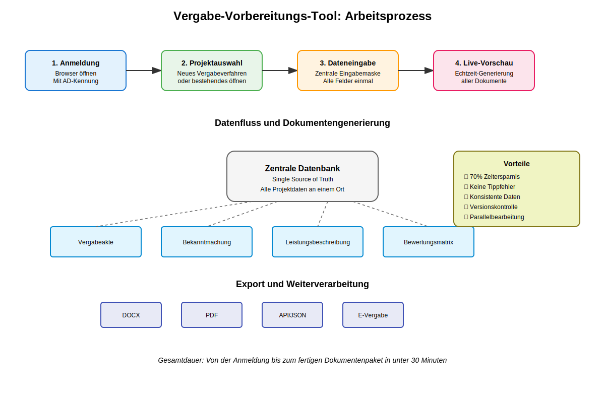

# City Challenge Berlin 2025 - Bewerbung
## Digitale Vergabevorbereitung für Berliner Behörden

### Kontaktdaten
**Unternehmen:** Augnum GmbH  
**Ansprechpartner:** Christoph Brändle  
**Kontakt:** +49176-99631772 / cb@augnum.com  
**Lösungstitel:** Vergabe-Vorbereitungs-Tool Berlin

---

## Der konkrete Arbeitsprozess im Detail

### 1. Der Ausgangspunkt: Die tägliche Herausforderung

Stellen Sie sich vor: Frau Müller aus der Vergabestelle SenWiEnBe sitzt an ihrem Schreibtisch. Vor ihr liegen 15 verschiedene Formulare für ein neues IT-Beschaffungsverfahren. Sie muss den Projektnamen "Modernisierung Fachverfahren XY" in jedes einzelne Formular eintragen. Den geschätzten Auftragswert von 250.000 EUR ebenfalls. Die CPV-Codes, die Fristen, die Ansprechpartner - alles 15 Mal.

Nach 4 Stunden hat sie alle Formulare ausgefüllt. Dann klingelt das Telefon: Die Projektbezeichnung muss geändert werden. Frau Müller seufzt und beginnt von vorne.

### 2. So funktioniert unsere Lösung



#### Schritt 1: Anmeldung (30 Sekunden)
Frau Müller öffnet ihren Browser und gibt die Adresse ein: `vergabe.berlin.local`. Sie wird automatisch mit ihrer Windows-Anmeldung eingeloggt (Single Sign-On über Active Directory). Kein separates Passwort, keine Zugangsdaten zum Merken.

#### Schritt 2: Projekt anlegen (2 Minuten)
Sie klickt auf "Neues Vergabeverfahren" und sieht:


Ein übersichtliches Dashboard mit allen ihren laufenden Verfahren. Sie wählt "Neues Projekt" und gibt die Grunddaten ein:
- Projektbezeichnung
- Vergabeart (Dropdown mit allen Optionen)
- Geschätzter Auftragswert
- Zuständige Abteilung

#### Schritt 3: Intelligente Datenerfassung (10 Minuten)
Jetzt kommt der Clou: Statt 15 verschiedene Formulare zu öffnen, sieht Frau Müller eine einzige, intelligent strukturierte Eingabemaske:


**Die Maske ist in logische Abschnitte gegliedert:**

**A) Basisdaten des Verfahrens**
- Vergabenummer (wird automatisch generiert)
- Projektbezeichnung
- Kurzbeschreibung (max. 200 Zeichen)
- Ausführliche Beschreibung

**B) Rechtliche Einordnung**
- Vergabeart (Offenes Verfahren, Verhandlungsverfahren, etc.)
- Geschätzter Auftragswert
- CPV-Codes (mit intelligenter Suche und Vorschlägen)
- Rahmenvertrag ja/nein
- Lose ja/nein (wenn ja: dynamische Losaufteilung)

**C) Termine und Fristen**
- Veröffentlichungsdatum
- Frist für Rückfragen
- Angebotsabgabefrist
- Bindefrist
- Geplanter Leistungsbeginn

Das Besondere: Das System kennt die gesetzlichen Mindestfristen. Wenn Frau Müller eine zu kurze Frist eingibt, erscheint eine freundliche Warnung: "Die Mindestfrist für ein offenes Verfahren beträgt 30 Tage. Ihre eingegebene Frist von 20 Tagen unterschreitet diese. Möchten Sie die Frist anpassen?"

**D) Eignungskriterien**
Hier kann Frau Müller aus vordefinierten Bausteinen wählen:
- Wirtschaftliche Leistungsfähigkeit (Mindestumsatz, Bankauskunft)
- Technische Leistungsfähigkeit (Referenzen, Zertifikate)
- Fachliche Eignung (Qualifikationen, Personalausstattung)

Jeder Baustein kann angepasst oder ergänzt werden.

#### Schritt 4: Live-Dokumentengenerierung
Während Frau Müller tippt, passiert rechts auf dem Bildschirm die Magie:


Sie sieht in Echtzeit, wie ihre Eingaben in die verschiedenen Dokumente übernommen werden:
- Die Vergabeakte wird automatisch strukturiert
- Die EU-Bekanntmachung füllt sich mit den korrekten Daten
- Die Bewerbungsbedingungen werden generiert
- Die Leistungsbeschreibung nimmt Form an

Ändert sie den Projektnamen, ändert er sich sofort in allen 15 Dokumenten. Kein Copy-Paste, keine Inkonsistenzen.

### 3. Die Word-Integration: Nahtloser Dokumentenaustausch

#### Upload bestehender Dokumente
Frau Müller hat bereits eine Leistungsbeschreibung in Word erstellt? Kein Problem:

1. Sie klickt auf "Dokument hochladen"
2. Wählt ihre DOCX-Datei aus
3. Das System analysiert das Dokument und extrahiert:
   - Überschriften und Gliederung
   - Markierte Platzhalter (z.B. {{Projektname}})
   - Tabellen mit technischen Spezifikationen
   - Formatierungen und Corporate Design

4. Die extrahierten Daten werden automatisch in die entsprechenden Felder übernommen
5. Das Original-Layout bleibt erhalten

#### Download und Weiterbearbeitung
Alle generierten Dokumente können als DOCX heruntergeladen werden:
- Originalformatierung bleibt erhalten
- Kommentare und Änderungsverfolgung möglich
- Nahtlose Weiterbearbeitung in Word
- Re-Upload nach Bearbeitung möglich

Das System merkt sich, welche Felder manuell in Word geändert wurden und fragt bei erneutem Upload: "In Ihrem Word-Dokument wurde das Feld 'Leistungsbeginn' auf den 01.04.2025 geändert. In der Datenbank steht noch 01.03.2025. Welchen Wert möchten Sie übernehmen?"

### 4. API-Integration: Ehrlich über die Anforderungen

#### Was funktioniert heute schon
- **Export als JSON/XML**: Alle Projektdaten können strukturiert exportiert werden
- **REST-API**: Andere Systeme können Daten abrufen (Read-Only)
- **Webhook-Benachrichtigungen**: Bei Statusänderungen werden andere Systeme informiert

#### Was die Vergabeplattform-API braucht
Für die direkte Übertragung zur Vergabeplattform berlin.de benötigen wir:

1. **API-Zugangsdaten**
   - Client-ID und Secret
   - Endpoint-URLs
   - Authentifizierungsmethode (OAuth2, API-Key, etc.)

2. **Schnittstellendokumentation**
   - Datenformat (XML-Schema, JSON-Structure)
   - Pflichtfelder und Validierungsregeln
   - Fehlerbehandlung

3. **Testumgebung**
   - Sandbox-Zugang zum Testen
   - Beispieldatensätze
   - Support-Kontakt bei Problemen

**Zeitaufwand für API-Integration:** 
- Mit vollständiger Dokumentation: 2 Wochen
- Ohne Dokumentation (Reverse Engineering): 4-6 Wochen
- Mit Unterstützung des Plattform-Betreibers: 1 Woche

### 5. KI-Unterstützung: Die Zukunft der Leistungsbeschreibung

#### Aktueller Stand: KI-Vorbereitung
Basierend auf den Erkenntnissen aus vergleichbaren Systemen haben wir die Architektur bereits für KI-Integration vorbereitet:

**Phase 1: Intelligente Vorschläge (bereits möglich)**
- Analyse bestehender Leistungsbeschreibungen
- Vorschlag passender Textbausteine
- Auto-Vervollständigung häufiger Formulierungen
- Plausibilitätsprüfung der Eingaben

**Phase 2: KI-gestützte Generierung (Zukunft)**
Das System könnte perspektivisch:

1. **Interaktive Befragung**
   ```
   KI: "Sie planen eine IT-Beschaffung. Ich habe einige Fragen, um eine 
        präzise Leistungsbeschreibung zu erstellen:"
   
   - Welche Hauptfunktionen soll die Software erfüllen?
   - Wie viele Nutzer werden das System verwenden?
   - Welche Schnittstellen zu Bestandssystemen sind erforderlich?
   - Welche Sicherheitsanforderungen bestehen?
   - Benötigen Sie Schulungen oder Support?
   ```

2. **Strukturierte Leistungsbeschreibung generieren**
   Basierend auf den Antworten erstellt die KI:
   - Funktionale Anforderungen
   - Technische Spezifikationen
   - Qualitätsstandards
   - Abnahmekriterien
   - Projektmeilensteine

3. **Marktrecherche einbeziehen**
   - Aktuelle Marktpreise
   - Verfügbare Lösungen
   - Best Practices
   - Technologietrends

#### Wichtige Einschränkungen und Datenschutz

**Was wir NICHT tun:**
- Keine Übertragung sensibler Daten an externe KI-Dienste
- Keine unkontrollierte Generierung rechtlich bindender Texte
- Keine Entscheidungen ohne menschliche Prüfung

**Was wir tun:**
- Lokale KI-Modelle auf behördeneigenen Servern (wenn verfügbar)
- Vier-Augen-Prinzip bei generierten Inhalten
- Kennzeichnung KI-generierter Textvorschläge
- Vollständige Protokollierung aller KI-Interaktionen

#### Konkretes Beispiel: Leistungsbeschreibung für Beratungsdienstleistung

**Eingabe durch Nutzer:**
"Wir benötigen externe Unterstützung für die Einführung eines Dokumentenmanagementsystems in unserer Behörde."

**KI-generierte Fragen:**
1. Wie viele Mitarbeiter nutzen das System?
2. Welches Dokumentenvolumen (GB/Jahr) erwarten Sie?
3. Welche Dokumententypen sollen verwaltet werden?
4. Bestehen Schnittstellen zu Fachverfahren?
5. Welche Compliance-Anforderungen gibt es?

**Resultierende Leistungsbeschreibung (Auszug):**
```
2. Leistungsgegenstand

2.1 Ausgangslage
Die [Behörde] verwaltet derzeit ca. [X] Dokumente in verschiedenen 
Ablagesystemen. Eine zentrale, digitale Dokumentenverwaltung existiert 
nicht. Dies führt zu Redundanzen, Suchzeiten und Compliance-Risiken.

2.2 Projektziel  
Implementierung eines modernen Dokumentenmanagementsystems (DMS) für 
[Anzahl] Arbeitsplätze mit folgenden Kernfunktionen:
- Zentrale Dokumentenablage mit Versionierung
- Volltextsuche über alle Dokumententypen
- Workflow-Engine für Freigabeprozesse
- DSGVO-konforme Löschkonzepte
- Schnittstellen zu [Fachverfahren]

2.3 Leistungsumfang Beratung
Der Auftragnehmer erbringt folgende Beratungsleistungen:
- IST-Analyse der aktuellen Dokumentenprozesse (20 PT)
- Konzeption der DMS-Architektur (15 PT)
- Unterstützung bei der Ausschreibung der DMS-Software (10 PT)
- Begleitung der Implementierung (30 PT)
- Schulung der Key-User (10 PT)
- Go-Live-Support und Optimierung (15 PT)
```

### 6. Technische Systemarchitektur im Detail

#### Backend-Architektur
```
┌─────────────────────────────────────────────────────┐
│                   Browser (Client)                   │
│          - Vanilla JavaScript                        │
│          - Real-time WebSocket                       │
│          - Progressive Web App                       │
└─────────────────────┬───────────────────────────────┘
                      │ HTTPS
┌─────────────────────┴───────────────────────────────┐
│                 PocketBase Server                    │
│  ┌─────────────────────────────────────────────┐   │
│  │            Core Services                      │   │
│  │  - Authentication (AD/LDAP)                  │   │
│  │  - Authorization (Role-Based)                │   │
│  │  - Real-time Subscriptions                   │   │
│  │  - File Management                           │   │
│  └─────────────────────────────────────────────┘   │
│  ┌─────────────────────────────────────────────┐   │
│  │         Document Engine                      │   │
│  │  - Template Processing                       │   │
│  │  - DOCX Generation (docxtemplater)          │   │
│  │  - PDF Rendering                            │   │
│  │  - Version Control                          │   │
│  └─────────────────────────────────────────────┘   │
│  ┌─────────────────────────────────────────────┐   │
│  │           SQLite Database                    │   │
│  │  - Projects                                  │   │
│  │  - Templates                                 │   │
│  │  - Users & Permissions                      │   │
│  │  - Audit Logs                              │   │
│  └─────────────────────────────────────────────┘   │
└─────────────────────────────────────────────────────┘
                      │ 
                      │ API Connections (optional)
                      ▼
┌─────────────────────────────────────────────────────┐
│          External Systems                           │
│  - Vergabeplattform Berlin API                     │
│  - E-Akte Integration                              │
│  - SAP Finance Interface                           │
│  - KI-Service (local deployment)                   │
└─────────────────────────────────────────────────────┘
```

#### Sicherheitsarchitektur

1. **Netzwerksicherheit**
   - Betrieb ausschließlich im Behördennetz
   - TLS 1.3 Verschlüsselung
   - Certificate Pinning
   - Web Application Firewall (WAF)

2. **Zugriffskontrolle**
   - Single Sign-On via Active Directory
   - Rollenbasierte Rechteverwaltung (RBAC)
   - Prinzip der minimalen Rechte
   - Zwei-Faktor-Authentifizierung (optional)

3. **Datensicherheit**
   - Verschlüsselung at-rest (AES-256)
   - Verschlüsselung in-transit (TLS)
   - Automatische Backups (stündlich/täglich)
   - Audit-Logging aller Zugriffe

### 7. Zusammenfassung: Was unsere Lösung wirklich leistet

**Für den einzelnen Sachbearbeiter:**
- 70% Zeitersparnis bei der Dokumentenerstellung
- Keine Tippfehler durch redundante Eingaben
- Intuitive Bedienung ohne Schulungsaufwand
- Mobiles Arbeiten möglich

**Für die Vergabestelle:**
- Standardisierte, rechtskonforme Dokumente
- Transparente Prozesse und Nachvollziehbarkeit
- Reduzierte Fehlerquote bei Vergabeverfahren
- Beschleunigte Durchlaufzeiten

**Für die IT-Abteilung:**
- Minimaler Wartungsaufwand
- Keine komplexen Systemabhängigkeiten
- Standardtechnologien (Go, SQLite, JavaScript)
- Vollständige Kontrolle durch Open Source

**Für die Behördenleitung:**
- Messbare Effizienzsteigerung
- Reduzierte Prozesskosten
- Erhöhte Rechtssicherheit
- Zukunftsfähige, erweiterbare Lösung

Die Investition von 25.000 EUR amortisiert sich bei durchschnittlich 50 Vergabeverfahren pro Jahr bereits nach 4 Monaten.