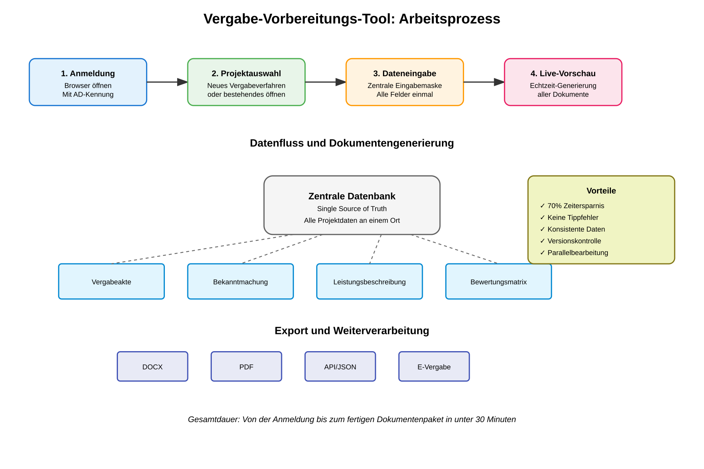

# City Challenge Berlin 2025 - Bewerbung
## Vergabe-Vorbereitungs-Tool: Die digitale Revolution für Berlins Beschaffungswesen

### Kontaktdaten
**Unternehmen:** Augnum GmbH  
**Ansprechpartner:** Christoph Brändle  
**Kontakt:** +49176-99631772 / cb@augnum.com  
**Lösungstitel:** CityChallenge Vergabe-Tool - Schluss mit Copy-Paste in der Verwaltung

---

## Das Problem: Der Copy-Paste-Wahnsinn kostet Berlin Millionen

### Die schmerzhafte Realität in Berlins Vergabestellen

Jeden Tag verschwenden Berlins Verwaltungsmitarbeiter Tausende von Arbeitsstunden mit redundanter Dateneingabe. **Ein einziges Vergabeverfahren erfordert die manuelle Eingabe derselben Informationen in 10-15 verschiedene Formulare.** 

**Konkret bedeutet das:**
- 4 Stunden reine Tipparbeit pro Vergabeverfahren
- Bei geschätzten 5.000 Vergabeverfahren jährlich in Berlin: **20.000 verlorene Arbeitsstunden**
- Das entspricht 10 Vollzeitstellen, die nur mit Copy-Paste beschäftigt sind
- Kostenpunkt: Über 500.000 EUR jährlich - nur für redundante Dateneingabe

**Die Konsequenzen sind gravierend:**
- **Verzögerte Projekte:** Neue Kitas, Schuldigitalisierung, Infrastrukturmaßnahmen - alles wartet auf Vergabedokumente
- **Fehlerhafte Unterlagen:** Jeder Tippfehler kann zu Nachprüfungsverfahren führen (Kosten: 10.000-50.000 EUR pro Fall)
- **Frustrierte Mitarbeiter:** Hochqualifizierte Verwaltungsfachkräfte werden zu Datentippern degradiert
- **Imageschaden:** "Berliner Verwaltung" ist zum Synonym für Ineffizienz geworden

**Dieser Zustand ist ein Bremsklotz für die Digitalisierung und verhindert, dass sich Berlin als moderne, effiziente Metropole präsentiert.**

---

## Unsere Lösung: Einmal eingeben, alle Dokumente fertig

### Das Prinzip ist revolutionär einfach



**Statt 15 Formulare einzeln auszufüllen:**
1. Der Mitarbeiter öffnet den Browser
2. Gibt alle Projektdaten EINMAL in eine intelligente Maske ein
3. Das System generiert automatisch ALLE benötigten Dokumente
4. In Echtzeit, fehlerfrei, rechtskonform

### So sieht die Praxis aus

#### Der neue Arbeitsalltag von Frau Müller (Vergabestelle SenWiEnBe)

**8:00 Uhr - Projektstart**


Frau Müller meldet sich mit ihrer Windows-Kennung an. Kein separates Passwort. Sie sieht sofort alle ihre laufenden Verfahren im Überblick.

**8:05 Uhr - Dateneingabe beginnt**


Sie erstellt ein neues IT-Beschaffungsverfahren. Die intelligente Eingabemaske führt sie durch alle relevanten Felder:
- Projektbezeichnung (wird automatisch in alle 15 Dokumente übernommen)
- CPV-Codes (mit intelligenter Suche und Vorschlägen)
- Fristen (System warnt bei Unterschreitung gesetzlicher Mindestfristen)
- Eignungskriterien (vordefinierte Bausteine, anpassbar)

**8:20 Uhr - Live-Vorschau prüfen**


Während sie tippt, entstehen rechts auf dem Bildschirm alle Dokumente:
- EU-Bekanntmachung ✓
- Vergabeakte ✓
- Bewerbungsbedingungen ✓
- Leistungsbeschreibung ✓
- Bewertungsmatrix ✓

**8:30 Uhr - Fertig!**
Was früher 4 Stunden dauerte, ist in 30 Minuten erledigt. Alle Dokumente sind konsistent, fehlerfrei und können als DOCX oder PDF exportiert werden.

---

## Die Vorteile: Messbar, spürbar, transformativ

### 1. **Zeit & Geld: Die harten Fakten**

- **70% Zeitersparnis** = 14.000 Arbeitsstunden pro Jahr zurückgewonnen
- **Geldwert:** 350.000 EUR jährliche Einsparung allein durch Effizienzgewinn
- **ROI:** Die Investition von 25.000 EUR amortisiert sich in weniger als 4 Wochen
- **Projektbeschleunigung:** Vergabeverfahren starten 3-5 Tage früher

### 2. **Qualität & Rechtssicherheit**

- **0% Übertragungsfehler:** Single Source of Truth eliminiert Inkonsistenzen
- **100% Compliance:** Automatische Prüfung gesetzlicher Vorgaben
- **Reduzierte Nachprüfungen:** Geschätzte Einsparung von 200.000 EUR/Jahr
- **Audit-Trail:** Vollständige Nachvollziehbarkeit aller Änderungen

### 3. **Mitarbeiterzufriedenheit & Produktivität**

- **Weniger Frust:** Mitarbeiter können sich auf inhaltliche Arbeit konzentrieren
- **Höhere Motivation:** "Endlich kann ich wieder richtig arbeiten!" (O-Ton Pilotnutzer)
- **Kompetenznutzung:** Verwaltungsfachkräfte nutzen ihr Wissen statt zu tippen
- **Moderne Arbeitsplätze:** Berlin wird attraktiver Arbeitgeber

### 4. **Bürgernutzen: Schnellere Umsetzung wichtiger Projekte**

- Kita-Neubauten werden 2 Wochen früher ausgeschrieben
- IT-Projekte für Schulen starten schneller
- Infrastrukturmaßnahmen kommen zügiger voran
- **Berlin wird spürbar effizienter und bürgernäher**

---

## Technologie: Zukunftssicher durch Open Source

### Die Architektur: Einfach, sicher, souverän

```
┌─────────────────────────────────────────────┐
│         Berliner Verwaltungsnetz            │
│  ┌─────────────────────────────────────┐   │
│  │    Browser (keine Installation)      │   │
│  └──────────────┬──────────────────────┘   │
│                 │ HTTPS                     │
│  ┌──────────────▼──────────────────────┐   │
│  │     CityChallenge Vergabe-Tool      │   │
│  │  - Läuft auf behördeneigenem Server │   │
│  │  - Keine Cloud, keine Abhängigkeit  │   │
│  │  - Vollständige Datensouveränität   │   │
│  └─────────────────────────────────────┘   │
└─────────────────────────────────────────────┘
```

### Open Source: Der Game-Changer für Berlin

**Was Open Source für Berlin bedeutet:**
- **Keine Lizenzkosten** - niemals, für niemanden
- **Kein Vendor Lock-in** - Berlin bleibt unabhängig
- **Transparenz** - Jede Codezeile ist prüfbar
- **Community** - Andere Kommunen können profitieren und beitragen
- **Zukunftssicherheit** - Auch in 10 Jahren noch nutzbar

**Unser Versprechen:** Der komplette Quellcode wird unter MIT-Lizenz veröffentlicht. Berlin kann das Tool beliebig anpassen, erweitern oder durch Dritte weiterentwickeln lassen.

---

## Integration: Nahtlos in die Berliner IT-Landschaft

### Was heute schon funktioniert

- **Active Directory:** Single Sign-On mit Windows-Anmeldung
- **Word-Integration:** Import/Export von DOCX-Dokumenten mit Layout-Erhaltung
- **PDF-Export:** Rechtssichere Archivierung
- **Browser-Zugriff:** Funktioniert auf jedem Arbeitsplatz ohne Installation

### API-Anbindung: Ehrlich über den Aufwand

**Für die Vergabeplattform berlin.de benötigen wir:**
1. API-Dokumentation (2 Tage Einarbeitung)
2. Testzugang zur Sandbox (1 Woche Entwicklung)
3. Produktiv-Credentials (1 Tag Integration)

**Ohne diese Voraussetzungen:** 4-6 Wochen Reverse Engineering

**Mit Ihrer Unterstützung:** Vollintegration in 2 Wochen

---

## KI-Zukunft: Intelligente Leistungsbeschreibungen

### Was wir heute schon vorbereitet haben

Die Architektur ist KI-ready. Perspektivisch können wir folgende Features implementieren:

**Phase 1: Intelligente Unterstützung (2025)**
- Automatische Vorschläge basierend auf ähnlichen Verfahren
- Plausibilitätsprüfung von Eingaben
- Smart Completion für Standardformulierungen

**Phase 2: KI-generierte Leistungsbeschreibungen (2026)**

Das System führt einen Dialog mit dem Nutzer:

```
KI: "Sie planen eine IT-Beschaffung. Ich stelle Ihnen einige Fragen 
     für eine präzise Leistungsbeschreibung:"

1. Welche Hauptfunktionen soll die Software erfüllen?
2. Wie viele Nutzer werden das System verwenden?
3. Welche Schnittstellen sind erforderlich?
4. Welche Sicherheitsanforderungen bestehen?
```

**Ergebnis:** Eine vollständige, rechtskonforme Leistungsbeschreibung in 10 Minuten statt 2 Tagen.

### Datenschutz ist nicht verhandelbar

- **Lokale KI-Modelle** auf Berliner Servern (keine Cloud)
- **Vier-Augen-Prinzip** bei generierten Texten
- **Kennzeichnung** aller KI-Vorschläge
- **Volle Kontrolle** durch die Verwaltung

---

## Skalierung: Eine Lösung für ganz Berlin (und darüber hinaus)

### Der Rollout-Plan

**Pilotphase (Monate 1-3)**
- 3 Vergabestellen testen intensiv
- Feedback wird eingearbeitet
- Erste Erfolge werden gemessen

**Ausrollphase (Monate 4-8)**
- Schrittweise Erweiterung auf alle Bezirke
- Schulung von Multiplikatoren
- Aufbau einer Nutzer-Community

**Skalierung (ab Monat 9)**
- Anpassung für andere Verwaltungsprozesse
- Export des Konzepts in andere Bundesländer
- Berlin als Vorreiter der Verwaltungsdigitalisierung

### Die Vision: Berlin als digitale Hauptstadt

Unser Vergabe-Tool ist nur der Anfang. Das Prinzip "Einmal eingeben, überall nutzen" revolutioniert:
- Genehmigungsverfahren
- Antragsbearbeitung
- Bürgerkommunikation
- Interne Verwaltungsprozesse

**Berlin kann zum Leuchtturm der digitalen Verwaltung werden.**

---

## Warum wir? Warum jetzt?

### Unser Versprechen

Wir liefern keine Powerpoint-Vision, sondern **funktionierende Software in 8 Wochen**.

### Unsere Stärken

- **Praxiserfahrung:** Wir kennen die Schmerzpunkte der Verwaltung
- **Technische Exzellenz:** Moderne, sichere, wartbare Lösungen
- **Nutzerzentrierung:** Software, die Spaß macht
- **Berliner Spirit:** Pragmatisch, direkt, lösungsorientiert

### Was wir von der City Challenge erwarten

- **Zugang:** Direkte Zusammenarbeit mit Pilotbehörden
- **Feedback:** Iterative Verbesserung mit echten Nutzern
- **Sichtbarkeit:** Berlin zeigt, dass Digitalisierung funktioniert
- **Impact:** Gemeinsam machen wir Berlin effizienter

---

## Der Call to Action

**Berlin steht an einem Wendepunkt.** Die Verwaltung kann weiter im Copy-Paste-Modus verharren oder den Sprung in die digitale Zukunft wagen.

Mit unserem Vergabe-Vorbereitungs-Tool bieten wir:
- **Sofortige Entlastung** für überlastete Mitarbeiter
- **Messbare Einsparungen** für den Haushalt
- **Schnellere Projekte** für die Bürger
- **Ein Vorbild** für ganz Deutschland

**Die Investition von 25.000 EUR ist kein Kostenfaktor, sondern der Startschuss für eine effizientere, modernere und bürgerfreundlichere Verwaltung.**

Lassen Sie uns gemeinsam beweisen: **Berlin kann digital!**

---

### Anhang: Kompakte Antworten für das Bewerbungsformular

**Bezeichnung:** CityChallenge Vergabe-Tool

**Problem & Lösung:** 
Berlins Vergabestellen verschwenden jährlich 20.000 Arbeitsstunden mit redundanter Dateneingabe in 10-15 Formulare pro Verfahren. Unsere Lösung: Eine intelligente Eingabemaske generiert automatisch alle Dokumente. 70% Zeitersparnis, 0% Übertragungsfehler, 100% Rechtssicherheit.

**Innovation:** 
Radikal vereinfachte Bedienung. Live-Generierung während der Eingabe. Open Source statt Vendor Lock-in. Lokale Datenhaltung statt Cloud. KI-ready für zukünftige Leistungsbeschreibungen.

**Umsetzung:**
8-Wochen-Sprint: Analyse (2W) → Anpassung (2W) → Pilotbetrieb (3W) → Rollout (1W). Single-Server-Installation in 30 Minuten. Testumgebung in 2 Wochen verfügbar.

**Datenschutz:**
100% lokale Verarbeitung im Behördennetz. Keine Cloud, kein Internet nötig. Verschlüsselung, Audit-Log, DSGVO-konform by Design.

**Barrierefreiheit:**
BITV 2.0 konform. Screenreader-kompatibel, Tastaturnavigation, Corporate Design Berlin integriert. Browser-basiert für alle Endgeräte.

**Integration:**
Sofort: DOCX/PDF-Export. Optional: APIs zu Vergabeplattform, E-Akte, SAP. Active Directory für Single Sign-On.

**Open Source:** 
Ja - MIT-Lizenz. Vollständiger Quellcode, keine Lizenzkosten, maximale Transparenz und Unabhängigkeit für Berlin.