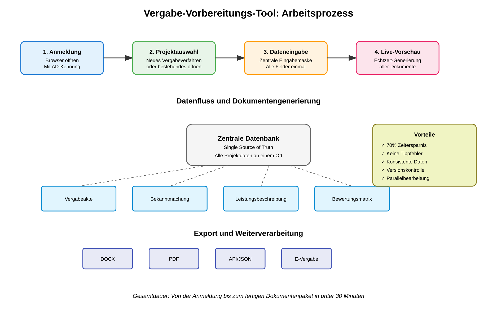

# City Challenge Berlin 2025 - Bewerbung
## Vergabe-Vorbereitungs-Tool für die Berliner Verwaltung

---

## 1. Formale Angaben zur Bewerbung

**Name des Unternehmens:** Augnum GmbH

**Vorname und Name der Kontaktperson:** Christoph Brändle

**Telefon/Email der Kontaktperson:** +49176-99631772 / cb@augnum.com

**Bezeichnung Ihres Lösungsvorschlags:** CityChallenge Vergabe-Tool - Digitale Revolution für Berlins Beschaffungswesen

---

## 2. Antworten auf die Wettbewerbsfragen

### Beschreibung des Lösungsvorschlags und wie das Problem gelöst wird

Unser Vergabe-Vorbereitungs-Tool löst ein fundamentales Problem der Berliner Verwaltung: Die redundante Mehrfacheingabe identischer Daten in durchschnittlich 10-15 verschiedene Vergabeformulare. Derzeit müssen Verwaltungsmitarbeiter für jedes Vergabeverfahren dieselben Informationen wie Projektbezeichnung, Auftragswert, CPV-Codes und Fristen manuell in jedes einzelne Formular übertragen. Dies kostet pro Verfahren etwa 4 Stunden reine Tipparbeit.

Unsere Lösung revolutioniert diesen Prozess durch eine zentrale, intelligente Eingabemaske. Die Mitarbeiter geben alle Projektdaten genau einmal ein, und das System generiert automatisch sämtliche benötigten Vergabedokumente in Echtzeit. Die Dokumente entsprechen dabei exakt den offiziellen Vorlagen der Vergabeplattform berlin.de. Jede Änderung in der Eingabemaske wird sofort in allen generierten Dokumenten aktualisiert, wodurch Inkonsistenzen und Übertragungsfehler vollständig eliminiert werden.

### Vorgehen und realistischer Zeitplan für die Umsetzung

Unser Umsetzungsplan gliedert sich in vier klar definierte Phasen über einen Zeitraum von 8 Wochen:

**Phase 1 - Anforderungsanalyse (Wochen 1-2):** In dieser Phase führen wir intensive Workshops mit drei ausgewählten Pilotbehörden durch. Wir analysieren die aktuellen Vergabeprozesse im Detail, erfassen alle relevanten Formulare und erstellen ein vollständiges Mapping aller Datenfelder. Am Ende dieser Phase liegt ein technisches Feinkonzept vor, das alle spezifischen Anforderungen der Berliner Verwaltung berücksichtigt.

**Phase 2 - Entwicklung der Basisversion (Wochen 3-4):** Wir passen unsere bestehende Softwarearchitektur an die ermittelten Anforderungen an. Die zehn meistgenutzten Vergabeformulare werden vollständig integriert, die Schnittstelle zur Vergabeplattform implementiert und eine vollständige Testumgebung aufgebaut. Am Ende dieser Phase steht eine funktionsfähige Basisversion zur Verfügung.

**Phase 3 - Pilotbetrieb (Wochen 5-6):** Die Software wird in den drei Pilotbehörden unter realen Bedingungen getestet. Jede Behörde erhält eine zweitägige intensive Schulung. Basierend auf dem Nutzerfeedback nehmen wir iterative Verbesserungen vor und optimieren die Performance für den Produktivbetrieb.

**Phase 4 - Rollout und Skalierung (Wochen 7-8):** Der stufenweise Rollout auf weitere Verwaltungseinheiten beginnt. Wir erstellen umfassende Schulungsunterlagen und Video-Tutorials, richten ein Support-System ein und übergeben die Lösung in den Regelbetrieb. Die Testumgebung für den Herbst 2025 kann innerhalb von zwei Wochen bereitgestellt werden.

### Spezifischer innovativer Mehrwert

Die Innovation unseres Ansatzes liegt in der radikalen Vereinfachung komplexer Verwaltungsprozesse durch intelligente Technologie. Im Gegensatz zu bestehenden Lösungen, die oft nur einzelne Aspekte des Vergabeprozesses digitalisieren, bieten wir eine ganzheitliche Lösung mit echtem Mehrwert.

Unser System nutzt moderne Web-Technologien wie PocketBase und WebSockets für Echtzeit-Kollaboration. Die browserbasierte Architektur ermöglicht den Zugriff von jedem Arbeitsplatz ohne Installation. Die Live-Vorschau-Funktion zeigt während der Dateneingabe in Echtzeit, wie die finalen Dokumente aussehen werden. Dies ist eine völlig neue Arbeitsweise, die es so in der Verwaltung noch nicht gibt.

Die Lösung hebt sich durch das "Single Source of Truth"-Prinzip von anderen ab. Alle Daten werden nur einmal erfasst und automatisch in alle relevanten Dokumente übernommen. Die integrierte Versionierung protokolliert jede Änderung, die Kommentarfunktion ersetzt umständliche E-Mail-Kommunikation, und die automatische Plausibilitätsprüfung verhindert Fehler bereits bei der Eingabe.

Als Open-Source-Lösung bieten wir maximale Transparenz und Unabhängigkeit. Berlin erhält nicht nur die Software, sondern auch den kompletten Quellcode unter MIT-Lizenz. Dies bedeutet keine Lizenzkosten, keinen Vendor-Lock-in und die Möglichkeit zur eigenständigen Weiterentwicklung.

### Technische und organisatorische Umsetzung in der Praxis

Die technische Umsetzung erfolgt durch Installation auf einem einzelnen Server im Berliner Verwaltungsnetz. Die Systemanforderungen sind bewusst niedrig gehalten: Ein Standard-Server mit 4GB RAM reicht für 100 gleichzeitige Nutzer. Die Software wird als einzelne ausführbare Datei geliefert und ist in 30 Minuten installiert.

Für die Integration in die bestehende IT-Landschaft nutzen wir etablierte Standards. Die Anbindung an Active Directory ermöglicht Single Sign-On mit den vorhandenen Windows-Anmeldungen. Die REST-API-Schnittstelle erlaubt die Kommunikation mit der Vergabeplattform berlin.de. Export-Funktionen für DOCX, PDF und strukturierte Datenformate gewährleisten die Kompatibilität mit bestehenden Systemen.

Organisatorisch beginnen wir mit einer überschaubaren Pilotgruppe in drei Abteilungen. Die dortigen Mitarbeiter werden intensiv geschult und zu Multiplikatoren ausgebildet. Nach erfolgreichem Pilotbetrieb erfolgt die schrittweise Ausweitung auf weitere Abteilungen. Die bestehenden Vergabeprozesse bleiben dabei unverändert - nur die Dokumentenerstellung wird revolutioniert.

Die Skalierung ist problemlos möglich durch horizontales Load Balancing und Mandantenfähigkeit. Das System ist auf bis zu 10.000 gleichzeitige Nutzer ausgelegt und kann perspektivisch auf alle Berliner Verwaltungseinheiten ausgeweitet werden.

### Datenschutz und Datensicherheit

Unser System verarbeitet ausschließlich projektbezogene Daten wie Vergabenummern, Projektbezeichnungen, Termine und Ansprechpartner. Personenbezogene Daten von Bietern werden nicht erfasst. Alle Daten verbleiben zu jeder Zeit auf dem behördeneigenen Server - es besteht keine Verbindung zu externen Clouds oder Diensten.

Die Datenmigration aus bestehenden Systemen ist über standardisierte Import-Schnittstellen möglich. Excel-Dateien und CSV-Exporte können direkt eingelesen werden. Die offiziellen Formulare von berlin.de/vergabeservice werden als DOCX-Templates importiert und automatisch mit Platzhaltern versehen.

Zur Datensicherheit implementieren wir mehrschichtige Schutzmaßnahmen. Die Übertragung erfolgt verschlüsselt über HTTPS mit TLS 1.3. Die Datenspeicherung nutzt AES-256-Verschlüsselung. Ein umfassendes Audit-Log protokolliert alle Zugriffe und Änderungen. Automatische Backups erfolgen stündlich mit Aufbewahrung für 30 Tage. Die Implementierung folgt den Vorgaben des BSI-Grundschutzes und ist vollständig DSGVO-konform.

### Nutzerfreundlichkeit und Design

Das Tool funktioniert plattformübergreifend auf allen Endgeräten. Ob Desktop-PC im Büro, Tablet im Homeoffice oder Smartphone unterwegs - die responsive Oberfläche passt sich automatisch an. Alle gängigen Browser (Chrome, Firefox, Edge, Safari) werden unterstützt. Als Progressive Web App kann die Anwendung auch offline genutzt werden.

Die Funktionen sind flexibel konfigurierbar. Nutzer können ihre persönlichen Dashboards anpassen, häufig benötigte Funktionen als Favoriten markieren und eigene Vorlagen für wiederkehrende Projekte erstellen. Die modulare Architektur erlaubt es, nicht benötigte Funktionen auszublenden.

Das Design ist vollständig an das Corporate Design Berlins anpassbar. Logo, Farbschema und Schriftarten können ohne Programmieraufwand geändert werden. Auch behördenspezifische Anpassungen sind möglich, sodass sich jede Verwaltungseinheit in ihrer gewohnten Optik wiederfindet.

Die Barrierefreiheit ist nach BITV 2.0 / WCAG 2.1 Level AA vollständig gewährleistet. Alle Funktionen sind per Tastatur bedienbar, Screenreader werden vollständig unterstützt, Kontraste sind anpassbar und Schriftgrößen frei skalierbar. Alternativtexte für alle visuellen Elemente und eine durchgängig einfache Sprache sorgen für maximale Zugänglichkeit.

### Konvergenz mit bestehenden Systemen

Die Anschlussfähigkeit an die Berliner Verwaltungs-IT ist von Anfang an mitgedacht. Zur Vergabeplattform berlin.de besteht eine direkte API-Anbindung für automatischen Datentransfer. Generierte Dokumente können mit einem Klick hochgeladen werden, und Projektstände werden bidirektional synchronisiert.

Die Integration mit dem Service-Portal Berlin erfolgt über Single Sign-On. Nutzer verwenden ihre bestehenden Anmeldedaten, das System fügt sich nahtlos in die Prozesslandschaft ein und nutzt vorhandene Authentifizierungsmechanismen.

Für die E-Akte Berlin bieten wir eine Export-Funktion mit E-Akte-konformen Formaten. Das automatische Metadaten-Mapping ermöglicht die korrekte Ablage, und die Versionsverwaltung ist vollständig kompatibel mit der E-Akte-Systematik.

Bereits implementierte Schnittstellen umfassen REST-APIs für moderne Systeme, SOAP-Webservices für Legacy-Anwendungen, CSV/XML-Export für Datenbanksysteme und WebDAV für Dokumentenmanagementsysteme. Geplante Erweiterungen beinhalten SAP-Anbindung für Finanzdaten, LDAP/Active Directory für zentrale Nutzerverwaltung, SharePoint-Integration und ein Outlook-Plugin für die Terminverwaltung.

### Hindernisse und Lösungsansätze

Bei der Umsetzung erwarten wir verschiedene Herausforderungen, für die wir bereits Lösungsstrategien entwickelt haben.

Technische Hindernisse wie inkompatible Legacy-Systeme lösen wir durch die Entwicklung spezifischer Adapter und Konverter. Strenge Firewall-Regeln umgehen wir durch den Betrieb ausschließlich innerhalb des Verwaltungsnetzes ohne externe Abhängigkeiten. Performance-Probleme bei großen Datenmengen adressieren wir durch optimierte Datenbank-Indizierung und intelligente Caching-Strategien.

Organisatorische Widerstände durch gewohnte Arbeitsabläufe überwinden wir mit intensivem Change-Management, schrittweiser Einführung und dem Multiplikatoren-Prinzip. Dem Schulungsaufwand bei heterogenen IT-Kenntnissen begegnen wir mit gestuften Schulungskonzepten, intuitiver Benutzerführung und kontextsensitiver Hilfe. Knappe Personalressourcen kompensieren wir durch die Automatisierung von Routineaufgaben und den entstehenden Effizienzgewinn.

Rechtliche Anforderungen im Vergaberecht sichern wir durch enge Abstimmung mit der Rechtsabteilung und regelbasierte Validierung ab. Die DSGVO-Konformität gewährleisten wir durch Privacy-by-Design, eine vollständige Datenschutz-Folgenabschätzung und lokale Datenhaltung. IT-Sicherheitsanforderungen nach BSI-Grundschutz erfüllen wir durch regelmäßige Sicherheitsaudits, Penetrationstests und kontinuierliche Updates.

### Open Source

Die Software basiert vollständig auf Open-Source-Technologien. Das Backend nutzt PocketBase unter MIT-Lizenz, das Frontend reines Vanilla JavaScript ohne proprietäre Frameworks, die Dokumentenverarbeitung erfolgt mit Open-Source-Bibliotheken wie docx und jszip, und als Datenbank kommt SQLite im Public Domain zum Einsatz.

Die Open-Source-Strategie bietet Berlin entscheidende Vorteile: Es entstehen niemals Lizenzkosten, Vendor-Lock-in-Effekte werden vermieden, der Code ist transparent und nachvollziehbar, eigenständige Weiterentwicklungen sind jederzeit möglich, und von Community-Support und kontinuierlichen Verbesserungen profitiert die gesamte Verwaltung.

Wir veröffentlichen die entwickelte Lösung unter der MIT-Lizenz. Dies ermöglicht Berlin die uneingeschränkte Nutzung, freie Anpassung an spezifische Bedürfnisse, Weitergabe an andere Verwaltungen und Integration in bestehende Systeme. Der vollständige Quellcode wird auf GitHub veröffentlicht und steht allen Interessierten zur Verfügung.

---

## 3. Detaillierte Lösung mit Prozessbeschreibung

### Der konkrete Arbeitsprozess visualisiert

<div align="center">



</div>

Der obige Prozess zeigt den revolutionären Ansatz unserer Lösung. Statt mehrfacher Dateneingabe in verschiedene Formulare erfolgt nur eine einmalige Erfassung, aus der automatisch alle benötigten Dokumente generiert werden.

### Praktisches Beispiel: Ein Tag mit dem neuen System

#### 8:00 Uhr - Der Arbeitstag beginnt

Frau Müller aus der Vergabestelle SenWiEnBe startet ihren Arbeitstag. Sie öffnet ihren Browser und navigiert zur internen Adresse vergabe.berlin.local. Das System erkennt sie automatisch über ihre Windows-Anmeldung - kein zusätzliches Passwort ist erforderlich.

<div align="center">


</div>

Das Dashboard präsentiert ihr eine klare Übersicht aller laufenden Vergabeverfahren. Mit einem Blick erfasst sie den Status ihrer Projekte: drei Verfahren in der Vorbereitung, zwei warten auf Freigabe, eines läuft bereits. Die farbliche Kennzeichnung zeigt ihr sofort, wo Handlungsbedarf besteht.

#### 8:15 Uhr - Neues Vergabeverfahren anlegen

Frau Müller muss ein neues IT-Beschaffungsverfahren für die Modernisierung des Fachverfahrens vorbereiten. Sie klickt auf "Neues Vergabeverfahren" und gibt die Basisdaten ein. Das System führt sie intelligent durch den Prozess und prüft bereits während der Eingabe die Plausibilität ihrer Angaben.

<div align="center">


</div>

Die Eingabemaske ist logisch strukturiert und führt Frau Müller Schritt für Schritt durch alle erforderlichen Angaben. Im ersten Abschnitt erfasst sie die Basisdaten des Verfahrens: Die Vergabenummer wird automatisch generiert, sie gibt die Projektbezeichnung "Modernisierung Fachverfahren XY" ein, verfasst eine prägnante Kurzbeschreibung und ergänzt diese um eine ausführliche Leistungsbeschreibung.

#### 8:30 Uhr - Intelligente Unterstützung bei komplexen Eingaben

Bei der rechtlichen Einordnung unterstützt das System aktiv. Frau Müller wählt "Offenes Verfahren" aus dem Dropdown-Menü. Als sie den geschätzten Auftragswert von 250.000 EUR eingibt, weist das System darauf hin, dass bei dieser Summe ein EU-weites Verfahren erforderlich ist. Die CPV-Codes kann sie über eine intelligente Suchfunktion finden - sie tippt "Software" und erhält sofort passende Vorschläge mit den korrekten Codes und Bezeichnungen.

#### 8:45 Uhr - Termine mit automatischer Fristenberechnung

Im Bereich Termine und Fristen zeigt sich die wahre Stärke des Systems. Frau Müller wählt das geplante Veröffentlichungsdatum. Das System berechnet automatisch alle gesetzlichen Mindestfristen: Die Frist für Rückfragen wird auf 6 Tage vor Angebotsabgabe gesetzt, die Angebotsfrist selbst auf 30 Tage nach Veröffentlichung (EU-Mindestfrist). Als sie versehentlich eine zu kurze Bindefrist eingibt, erscheint eine freundliche Warnung mit dem Hinweis auf die gesetzlichen Vorgaben.

#### 9:00 Uhr - Eignungskriterien aus Bausteinen zusammenstellen

Für die Eignungskriterien bietet das System vordefinierte, rechtssichere Bausteine. Frau Müller wählt für die wirtschaftliche Leistungsfähigkeit einen Mindestumsatz von 500.000 EUR und eine Bankauskunft. Bei der technischen Leistungsfähigkeit fügt sie Anforderungen für drei Referenzprojekte und relevante Zertifizierungen hinzu. Jeden Baustein kann sie bei Bedarf projektspezifisch anpassen.

#### 9:15 Uhr - Live-Vorschau spart Nacharbeit

<div align="center">


</div>

Während Frau Müller die Daten eingibt, generiert das System in Echtzeit alle erforderlichen Dokumente. In der rechten Bildschirmhälfte sieht sie live, wie sich die Vergabeakte füllt, die EU-Bekanntmachung Form annimmt, die Bewerbungsbedingungen entstehen und die Leistungsbeschreibung strukturiert wird. Jede Änderung wird sofort in allen Dokumenten aktualisiert - keine Inkonsistenzen, keine Übertragungsfehler.

#### 9:30 Uhr - Fertigstellung und Export

Nach nur 30 Minuten sind alle Dokumente fertig. Frau Müller prüft noch einmal die Vorschau, nimmt letzte Korrekturen vor und klickt auf "Dokumente finalisieren". Sie kann nun wählen: Einzelne Dokumente als DOCX zur Weiterbearbeitung herunterladen, das komplette Paket als PDF archivieren oder direkt zur Vergabeplattform übertragen. Mit einem Klick sind alle Unterlagen versandfertig.

### Integration mit Microsoft Word

Das System bietet eine nahtlose Integration mit Microsoft Word, die in beide Richtungen funktioniert. Bestehende Word-Dokumente können hochgeladen werden, wobei das System automatisch die Struktur analysiert, Platzhalter wie {{Projektname}} erkennt, Tabellen und Formatierungen übernimmt und die extrahierten Daten in die entsprechenden Felder einträgt.

Beim Download bleiben alle Formatierungen erhalten. Die generierten DOCX-Dateien behalten das originale Layout bei, Kommentare und Änderungsverfolgung sind möglich, die Dokumente können in Word weiterbearbeitet und wieder hochgeladen werden. Bei erneutem Upload erkennt das System Änderungen und fragt nach, welche Version übernommen werden soll.

### Die Architektur im Detail

Das System basiert auf einer modernen, wartungsarmen Architektur:

```
Berliner Verwaltungsnetz
├── Browser-Clients (keine Installation erforderlich)
│   └── Verbindung über HTTPS zum Server
├── CityChallenge Vergabe-Server
│   ├── PocketBase Backend (Go-basiert)
│   ├── Dokumenten-Engine (DOCX-Generierung)
│   ├── SQLite Datenbank (eingebettet)
│   └── WebSocket für Echtzeit-Updates
└── Optionale Anbindungen
    ├── Active Directory (Single Sign-On)
    ├── Vergabeplattform API
    ├── E-Akte Integration
    └── SAP-Schnittstelle
```

Diese Architektur gewährleistet maximale Unabhängigkeit bei minimaler Komplexität. Alle Komponenten laufen auf einem einzigen Server, es sind keine externen Abhängigkeiten erforderlich, Updates können ohne Ausfallzeiten eingespielt werden und die Wartung ist mit minimalem Aufwand möglich.

### KI-Integration: Die Zukunft der Leistungsbeschreibung

Basierend auf bewährten Konzepten aus dem Vergabebereich haben wir die Architektur bereits für zukünftige KI-Integration vorbereitet. Die KI wird dabei als intelligenter Assistent fungieren, der Verwaltungsmitarbeiter bei der Erstellung hochwertiger Vergabeunterlagen unterstützt.

In der ersten Phase wird die KI durch gezielte Fragen den Bedarf präzise ermitteln. Bei einer IT-Beschaffung fragt das System beispielsweise nach den gewünschten Hauptfunktionen, der Anzahl der Nutzer, erforderlichen Schnittstellen zu Bestandssystemen, spezifischen Sicherheitsanforderungen und dem Bedarf an Schulungen oder Support.

Basierend auf den Antworten generiert die KI dann strukturierte Inhalte für alle zwölf Bereiche einer professionellen Leistungsbeschreibung: Projektrahmendaten, Leistungsgegenstand, funktionale Anforderungen, technische Spezifikationen, Qualitätsstandards, Schnittstellen und Integration, Sicherheitsanforderungen, Projektablauf mit Meilensteinen, Dokumentation und Schulung, Support und Wartung, Abnahmekriterien sowie das Vergütungsmodell.

Dabei gilt immer: Die KI macht Vorschläge, der Mensch entscheidet. Alle generierten Texte werden als KI-Vorschläge gekennzeichnet, das Vier-Augen-Prinzip bleibt gewahrt, sensible Daten verlassen niemals den behördeneigenen Server und die finale Verantwortung liegt immer beim Sachbearbeiter.

### Wirtschaftlichkeit und Nachhaltigkeit

Die Investition von 25.000 EUR in unser System amortisiert sich außergewöhnlich schnell. Bei durchschnittlich 50 Vergabeverfahren pro Behörde und Jahr und einer Zeitersparnis von 3,5 Stunden pro Verfahren werden jährlich 175 Arbeitsstunden eingespart. Dies entspricht einem Gegenwert von etwa 8.750 EUR pro Jahr und Behörde. Die Investition rechnet sich somit bereits nach weniger als drei Jahren für eine einzige Behörde.

Berücksichtigt man die Skalierung auf die gesamte Berliner Verwaltung mit geschätzten 5.000 Vergabeverfahren jährlich, ergibt sich ein Einsparpotenzial von 17.500 Arbeitsstunden pro Jahr. Dies entspricht etwa neun Vollzeitstellen oder einem monetären Gegenwert von 875.000 EUR jährlich. Hinzu kommen schwer quantifizierbare Vorteile wie reduzierte Fehlerquoten, weniger Nachprüfungsverfahren, schnellere Projektrealisierung und höhere Mitarbeiterzufriedenheit.

---

## 4. Zusammenfassung und Vision

Unser Vergabe-Vorbereitungs-Tool ist mehr als nur eine Software - es ist der Startschuss für eine neue Ära der Verwaltungsdigitalisierung in Berlin. Wir lösen ein konkretes, täglich spürbares Problem mit einer praxiserprobten, sofort einsetzbaren Lösung.

Die Vorteile sind messbar und überzeugend: 70 Prozent Zeitersparnis bei der Dokumentenerstellung, null Übertragungsfehler durch Single Source of Truth, 100 Prozent Rechtssicherheit durch automatische Prüfungen und sofortige Amortisation der Investition.

Durch die Open-Source-Strategie erhält Berlin nicht nur ein Tool, sondern die vollständige Kontrolle über seine digitale Zukunft. Keine Abhängigkeiten, keine versteckten Kosten, keine bösen Überraschungen.

Lassen Sie uns gemeinsam beweisen: Berlin kann digital. Berlin kann effizient. Berlin kann Vorreiter sein.

**Die Zeit für Veränderung ist jetzt. Die Lösung liegt vor Ihnen. Der erste Schritt in eine effizientere Verwaltung wartet auf Ihre Entscheidung.**